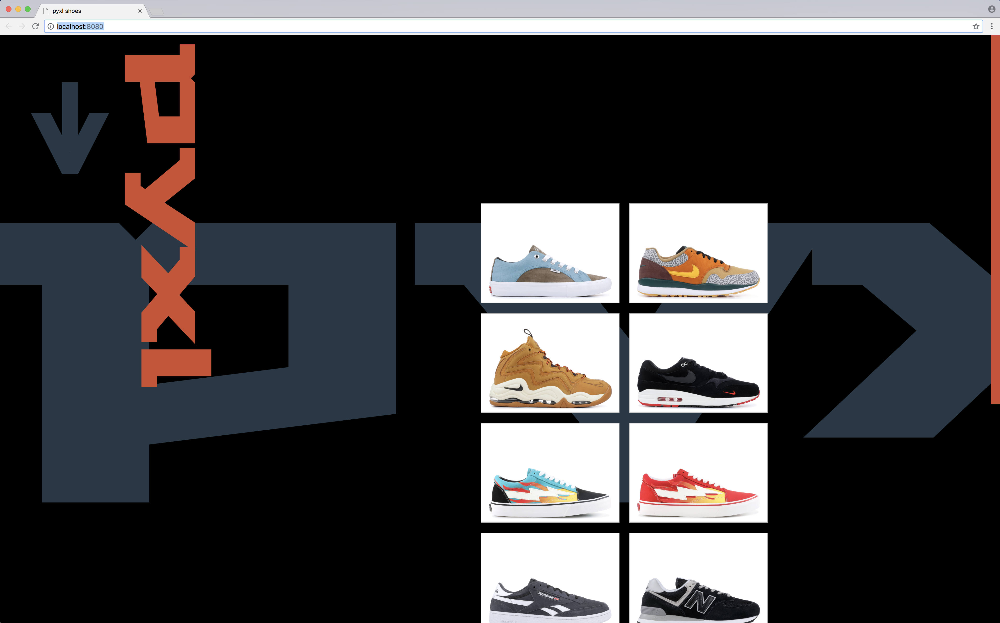
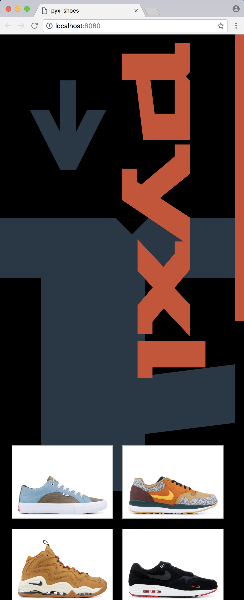
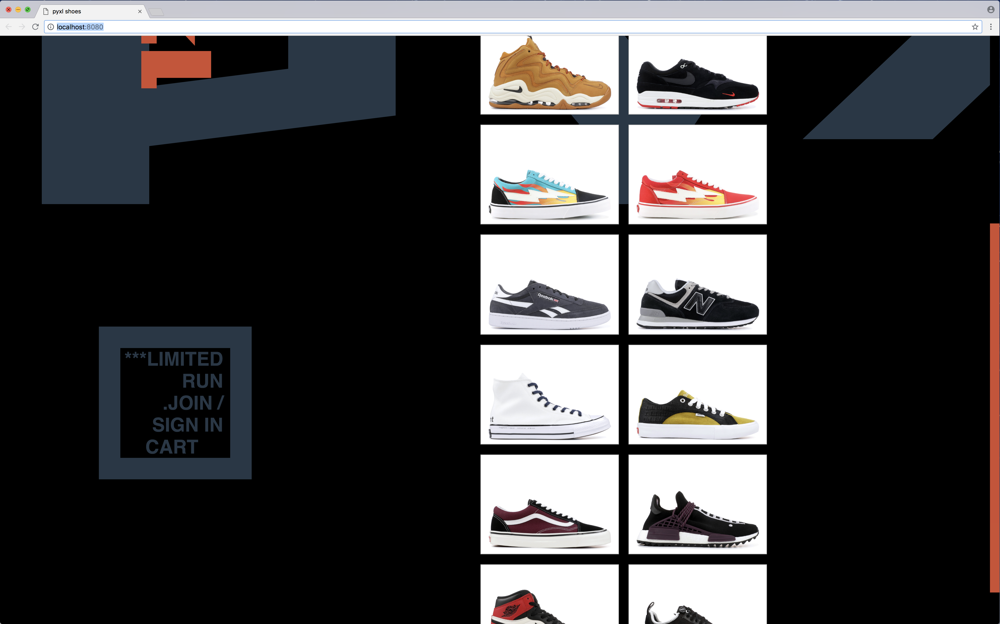
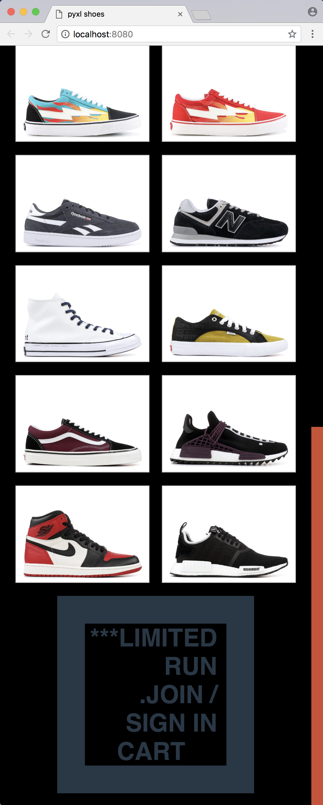

# pyxl shoes

#### By _**Kendra Kelly**_

## Description
This project is to build a trendy shoe site & branding. Used to practice with media queries and responsive design.

## Brand Identity
A trendy new shoe brand is about to launch. They're attempting to become the next big name in a type of fashion they call streetwear, but need a site to represent their brand and complete online sales. They tried making their own, but didn't get anywhere. So they've hired you!

When describing their brand and vision, they use the words "cool" and "like a viral phenomenon" more times than you can count.
You're not sure if you agree with this desire ethically, but you did hear them say "We want to be one of those brands where people pay $200 for a ball cap just because it has our name on it. Even if it's just a $6 ballcap. You know?"
They also told you "We want to feel illusive and viral. Like a brand that just popped up out of nowhere, and no one really knows the story. But in an appealing way."
They let you know doing limited releases of all our stuff. No restocks. No reprints. They want this to be emphasized, so people feel like all their products are one-of-a-kind and hard-to-get.
Content

## Focus on
* A Store area to purchase shoes and other accessories.
* Fully-responsive pages that gracefully adapt to all screen sizes, looking just as slick.

## Setup/Installation Requirements
Using Command Line:
1. ``git clone https://github.com/coffeeringsdesign/pyxl-shoes.git `` to clone the site.
2. ``cd ~`` to navigate to base directory
3. ``cd Desktop `` to navigate to your desktop
4. ``cd pyxl-shoes`` to enter the site folder
5. ``npm init -y`` to initialize node
6. ``npm install`` to install all webpack dependencies
7. ``npm run start`` this will webpack and immediate pop open the site on your brower. I recommend Chrome.
8. Use Atom to edit any html, javascript, or sass.

## Final Screen Shots

Large Screen Screenshots | Mobile Screenshots
---------------------- | -----------------------
 | 
 | 

## Support and contact details

Please feel free to get in touch. Reach out to me at kendra@coffeeringsdesign.com.

## Technologies Used

Javascript, Webpack, Sketch, Bootstrap, Sass, JQuery, & Atom.

### License

*MIT*

Copyright (c) 2018 **Kendra Kelly**
